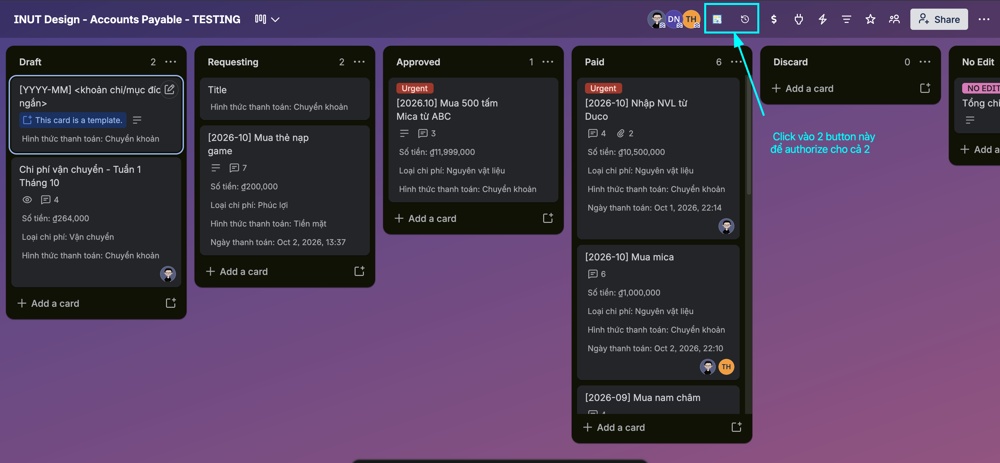
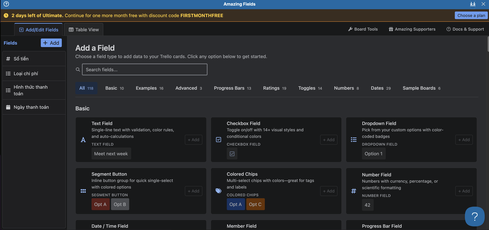
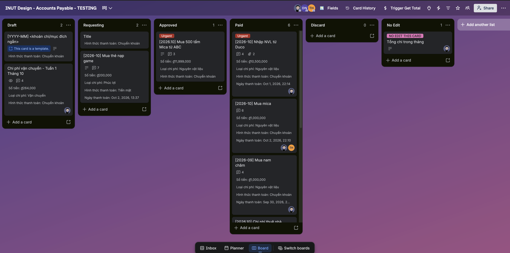
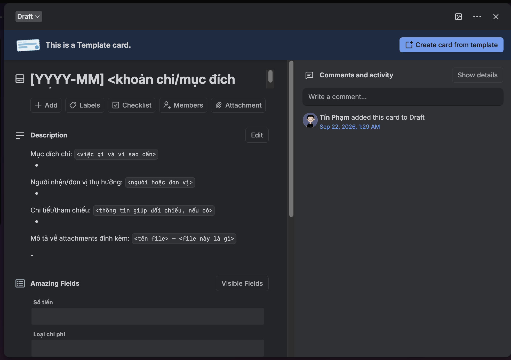
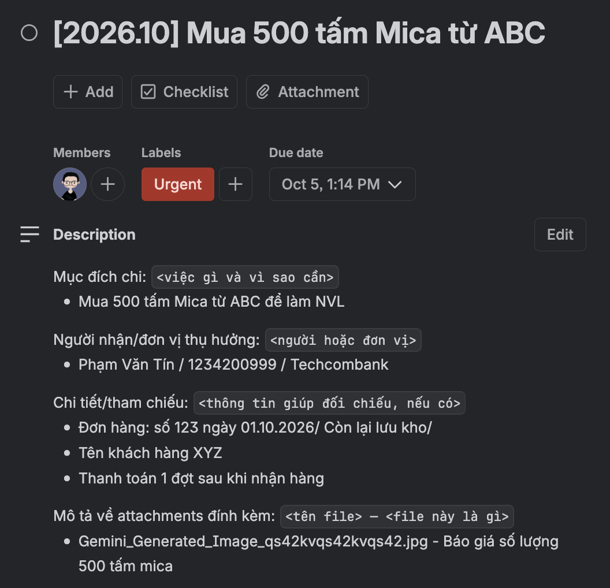
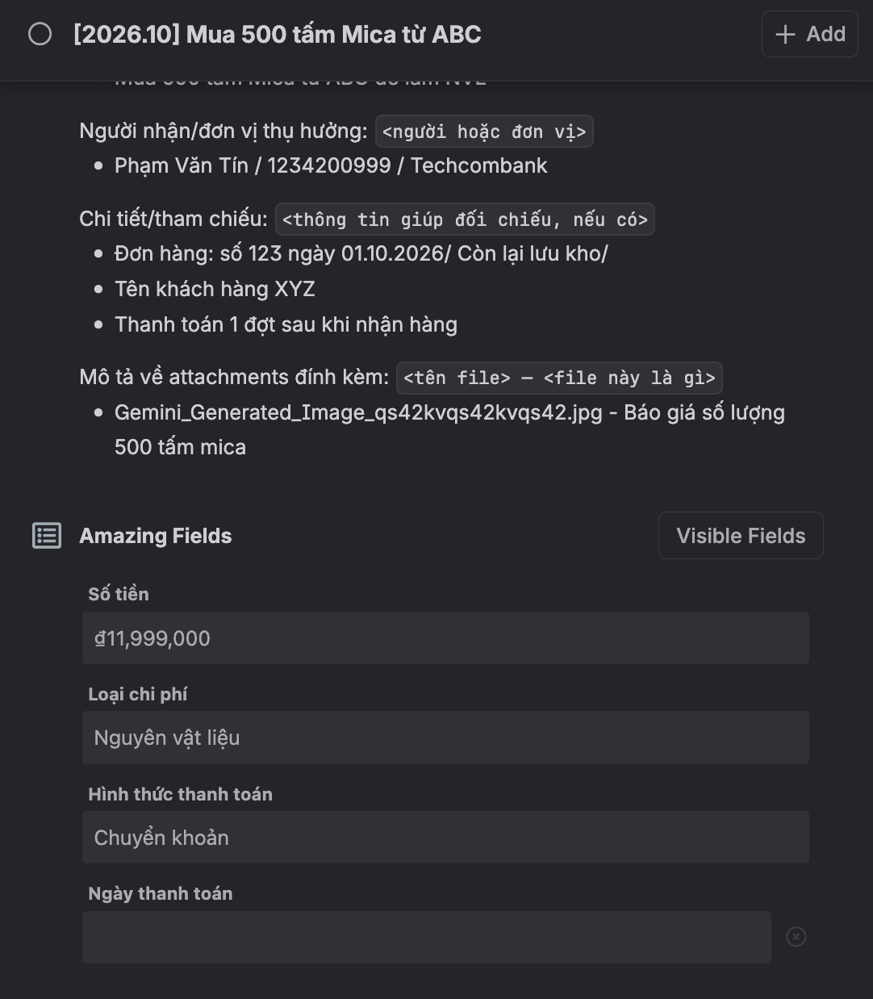
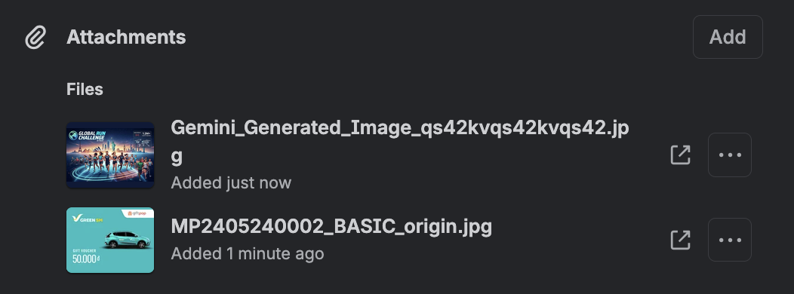
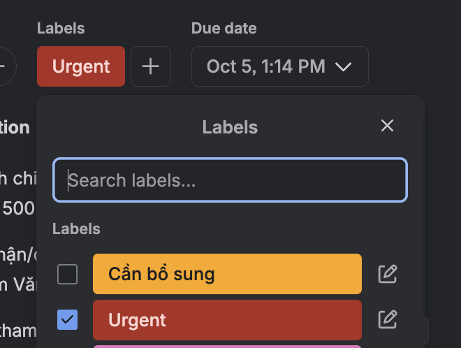
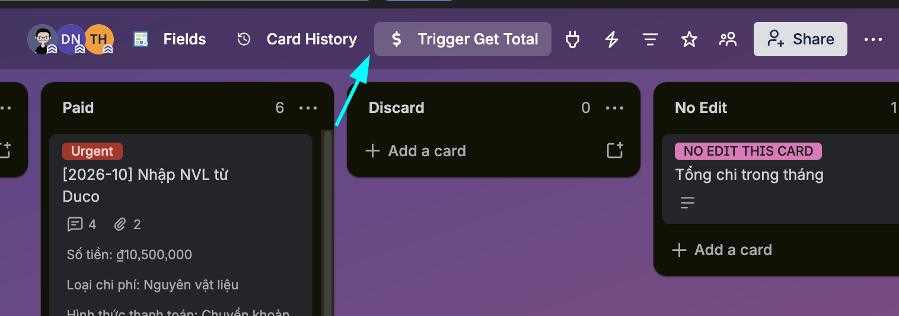
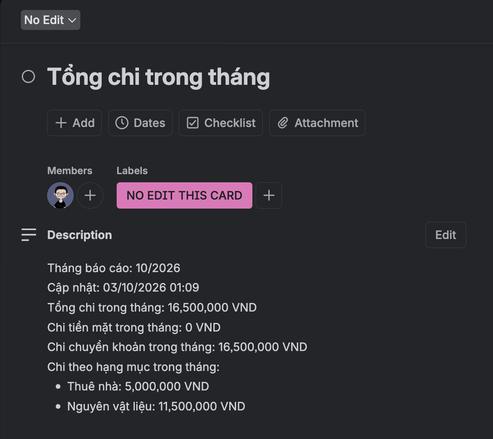

# Hướng dẫn sử dụng board AP Process

**Đối tượng:** người đề nghị chi, Giám đốc, Kế toán và người vận hành.  
**Giao diện hướng dẫn:** Trello Web trên desktop.  
**Cách dùng tài liệu:** đọc các bước bằng text; thay các placeholder `[Ảnh ...]` bằng ảnh chụp đã che dữ liệu nhạy cảm.

> **Trạng thái vận hành:** Theo xác nhận của chủ board ngày 03/10/2026, board đang dùng có nút `Trigger Get Total`, tự chạy khi card được chuyển vào `Paid`, và cron 19:00 giờ Việt Nam. Khi host ngủ do ít hoạt động, lượt đầu có thể mất khoảng 50–60 giây để khởi động; chờ tối đa 3 phút trước khi báo lỗi. Hướng dẫn này không lưu URL, credentials hoặc nội dung giao dịch.

## 1. Trước khi thao tác: authorize hai Power-Up

Board cần có **Amazing Fields** và **Card History**. Board owner/admin bật cả hai Power-Up trên board; mỗi người dùng cần mở từng icon trên toolbar và hoàn tất authorize theo hướng dẫn Trello trước khi dùng:

1. Mở icon **Amazing Fields** và authorize tài khoản. Dùng Power-Up này để xem/nhập các field của phiếu.
2. Mở icon **Card History** và authorize tài khoản. Dùng Power-Up này để xem lịch sử thay đổi title và Description khi cần truy vết.
3. Nếu không thấy icon, không có quyền authorize hoặc quá trình bị lỗi, báo board owner/admin; không dùng tài khoản của người khác.

`Amazing Fields` chứa dữ liệu có cấu trúc mà service dùng để tính. `Card History` hỗ trợ truy vết thay đổi; nó không thay thế comment bàn giao hay các field Amazing Fields.

**[Ảnh 1 — Toolbar có hai icon Amazing Fields và Card History]**  


**[Ảnh 2 — Màn hình sau khi authorize từng Power-Up]**



## 2. Ai làm gì

| Vai trò           | Trách nhiệm                                                                                                                                                     |
| ----------------- | --------------------------------------------------------------------------------------------------------------------------------------------------------------- |
| Người đề nghị chi | Tạo ticket ở `Draft`, tự assign, ghi rõ mục đích/người nhận, nhập các field đề nghị, đính kèm chứng từ và gửi sang `Requesting`.                                |
| Giám đốc          | Review tính hợp lý và thông tin của đề nghị; duyệt hoặc yêu cầu bổ sung. Khi duyệt, chuyển sang `Approved` và bàn giao Kế toán.                                 |
| Kế toán           | Kiểm tra nội dung/chứng từ và thông tin thanh toán ở `Approved`; sau khi thanh toán mới nhập Ngày thanh toán thực tế rồi chuyển sang `Paid`.                    |
| Người vận hành    | Theo dõi lỗi service/Telegram, mở đúng ticket cần sửa và báo người phụ trách. Không sửa dữ liệu nguồn thay cho requester/Kế toán.                               |
| Service           | Tự tính lại khi ticket được chuyển vào `Paid`; cron chạy lúc 19:00 giờ Việt Nam. Service chỉ cập nhật description card tổng, không duyệt hoặc sửa ticket nguồn. |

Trello Free không khóa các thao tác theo vai trò. Nhóm cần tự tuân thủ luồng và để lại comment mỗi lần chuyển list, kể cả chuyển ngược để sửa.

**[Ảnh 3 — Các list Draft, Requesting, Approved, Paid và Discard trên board]**


## 3. Tạo một ticket đúng ở Draft

### 3.1 Đặt title và ghi Description

Dùng một format title thống nhất:

```text
[YYYY-MM] <khoản chi/mục đích ngắn>
```

`YYYY-MM` là kỳ đề nghị để dễ tìm ticket; **không quyết định tháng báo cáo**. Tháng báo cáo được tính từ Ngày thanh toán thực tế do Kế toán nhập sau này.

Trong Description native của Trello, dùng các dòng sau để người duyệt và Kế toán biết khoản chi phục vụ việc gì, cho ai và chứng từ nào liên quan:

```text
Mục đích chi: <việc gì và vì sao cần>
Người nhận/đơn vị thụ hưởng: <người hoặc đơn vị>
Chi tiết/tham chiếu: <thông tin giúp đối chiếu, nếu có>
Mô tả về attachments đính kèm:
- <tên file> — <file này là gì>
```

Thay nội dung trong dấu `<...>` bằng thông tin phù hợp; không để câu chung chung như “chi phí tháng này”. Nếu một mục không áp dụng, ghi rõ “không áp dụng” hoặc lý do thay vì để người review phải đoán. Nếu Description thay đổi theo góp ý, giữ lại nội dung đủ để người duyệt hiểu mục đích hiện tại.



### 3.2 Nhập field trong Amazing Fields

- **Số tiền:** nhập số tiền đề nghị bằng VND.
- **Loại chi phí:** chọn đúng một hạng mục phù hợp.
- **Hình thức thanh toán:** chọn Tiền mặt hoặc Chuyển khoản theo dự kiến/thỏa thuận.
- **Ngày thanh toán:** để trống ở Draft. Đây là ngày/giờ thực chi, không phải ngày đề nghị hoặc hạn cần thanh toán.

Tự assign mình vào ticket để thể hiện người đang đề nghị và chịu trách nhiệm bổ sung thông tin.

**[Ảnh 4 — Ticket Draft với title và Description đã khử dữ liệu]**  


**[Ảnh 5 — Amazing Fields: các field đề nghị đã điền, Ngày thanh toán còn trống]**



### 3.3 Đính kèm chứng từ và dùng label khi cần

Đính kèm file/link hỗ trợ trực tiếp bằng chức năng **Attachment** native Trello khi có chứng từ. Trong Description, ghi tên file và ý nghĩa để người review biết cần mở gì. Không để thông tin thiết yếu chỉ nằm trong tên file.

Chỉ dùng hai label được thống nhất:

- **Cần bổ sung:** reviewer yêu cầu requester sửa hoặc cung cấp thông tin/chứng từ. Kèm comment ghi chính xác phần còn thiếu, assign và @mention người cần xử lý.
- **Urgent:** chỉ khi thực sự có hạn xử lý gấp. Điền ngày/giờ hạn trong trường **Dates** native Trello cùng label `Urgent`. Label không thay thế hạn thực tế, không thay đổi thứ tự duyệt và không làm ticket tự vào `Paid`.

Label chỉ hỗ trợ phối hợp; service không dùng label để tính tiền hoặc xác định trạng thái thanh toán.

**[Ảnh 6 — Attachment native và mô tả file trong Description; che tên/chi tiết chứng từ]**  




**[Ảnh 7 — Hai label được phép và trường Dates khi cần đánh dấu Urgent]**


## 4. Full flow của ticket

### Draft → Requesting: người đề nghị gửi duyệt

1. Kiểm tra title, Description, Amazing Fields và attachments đã đủ rõ.
2. Tự assign vào ticket.
3. Chuyển card sang `Requesting`.
4. Assign Giám đốc và comment @mention Giám đốc, nêu ngắn gọn cần review.

### Requesting → Approved: Giám đốc review

Giám đốc kiểm tra mục đích chi, người nhận/đơn vị thụ hưởng, tính hợp lý, số tiền, hạng mục, phương thức và chứng từ. Nếu đủ điều kiện:

1. Comment quyết định/bối cảnh duyệt.
2. Chuyển sang `Approved`.
3. Assign Kế toán và comment @mention để bàn giao kiểm tra/thanh toán.

Giám đốc không chuyển sang `Paid`; chỉ xác nhận đề nghị được duyệt để Kế toán xử lý.

### Khi cần bổ sung hoặc thay đổi sau khi duyệt

- Thêm label `Cần bổ sung`, comment rõ nội dung cần sửa, assign và @mention requester.
- Nếu đang ở `Requesting` và cần requester sửa trước khi Giám đốc duyệt, đưa về `Draft`. Sau khi sửa, requester comment phần đã cập nhật, bỏ label khi đã đủ, rồi chuyển lại `Requesting` để review lại.
- Nếu đã `Approved` mà mục đích, số tiền, hạng mục hoặc người nhận thay đổi, đưa về `Requesting` để Giám đốc review lại; sau đó assign/bàn giao Kế toán lần nữa.
- Mọi lần chuyển list phải có comment. Không dùng label để thay đổi quy trình duyệt.

### Approved → Paid: Kế toán thanh toán và ghi ngày thực tế

1. Kế toán kiểm tra lại Description, chứng từ, số tiền, loại chi phí và phương thức thực tế.
2. Chỉ sau khi đã thanh toán, Kế toán nhập **Ngày thanh toán gồm cả ngày và giờ thực chi** trong Amazing Fields.
3. Kiểm tra field đã lưu đúng rồi mới chuyển sang `Paid`.
4. Comment xác nhận đã thanh toán, ngày/giờ và phương thức; có thể @mention requester.
5. Giữ ticket đã Paid ở `Paid`. **Không archive, chuyển sang `Discard` hoặc xóa**, vì service cần đọc lại các khoản Paid.

Theo cấu hình hiện tại, chuyển ticket vào `Paid` kích hoạt tính lại card tổng. Không cần bấm thêm nút cho từng ticket vừa Paid.

### Discard: phiếu không tiếp tục nhưng chưa thanh toán

Chỉ phiếu **chưa chi** mới được chuyển sang `Discard`. Comment lý do hủy và @mention người liên quan trước khi archive. Nếu muốn dùng lại, khôi phục về `Draft` hoặc `Requesting` và thực hiện review lại.

**[Ảnh 8 — Requesting: assign Giám đốc và comment @mention]**  
**[Ảnh 9 — Approved: comment duyệt, assign và bàn giao Kế toán]**  
**[Ảnh 10 — Paid: Ngày thanh toán thực tế đã lưu và comment xác nhận]**  
**[Ảnh 11 — Cần bổ sung: label, comment yêu cầu sửa và assign requester]**  
**[Ảnh 12 — Discard: comment lý do trước khi archive ticket chưa chi]**

## 5. Khi nào card tổng được cập nhật

Theo xác nhận của chủ board, hiện có ba cách tự động/thủ công:

1. **Tự động khi chuyển vào `Paid`:** một ticket vừa được chuyển vào Paid sẽ kích hoạt lượt tính lại.
2. **Nút `Trigger Get Total`:** dùng để yêu cầu cập nhật thủ công khi thật sự cần, chẳng hạn sau khi đã sửa dữ liệu và cần kiểm tra lại. Không bấm cho từng ticket và không bấm liên tục.
3. **Cron hằng ngày lúc 19:00 giờ Việt Nam:** tự chạy theo lịch; người dùng không cần bấm nút để thay thế lượt chạy hằng ngày.

Service có thể ngủ khi không có request. Khi được gọi sau một khoảng không hoạt động, cold start thường mất khoảng **50–60 giây**. Chờ tối đa **3 phút** trước khi kết luận card chưa cập nhật.

Không bấm `Trigger Get Total` cho từng ticket; chuyển vào Paid đã tự kích hoạt. Nếu Paid-trigger request trùng với lượt đang chạy, không giả định card tổng đã cập nhật ngay; kiểm tra dòng `Cập nhật`, để cron chạy hoặc bấm thủ công một lần sau khi lượt trước kết thúc. Không bấm lặp lại để “ép” cập nhật.

Sau lượt chạy, mở card **Tổng chi trong tháng** và kiểm tra:

1. `Tháng báo cáo` đúng tháng cần xem.
2. `Cập nhật` là thời điểm chạy thành công gần nhất.
3. Tổng chi, tiền mặt, chuyển khoản và breakdown hạng mục có hiển thị.
4. Breakdown theo hạng mục cộng bằng tổng chi.

Tháng tính báo cáo dựa trên Ngày thanh toán thực tế theo giờ Việt Nam, không phải prefix tháng trong title.

**[Ảnh 13 — Nút `Trigger Get Total` trên toolbar board]**  


**[Ảnh 14 — Card tổng với thứ tự Tháng báo cáo, Cập nhật, các tổng và breakdown; dùng dữ liệu giả hoặc che toàn bộ giá trị thật]**


## 6. Nếu card tổng không cập nhật hoặc có lỗi

- Không bấm nút lặp lại. Đợi cold start và tối đa 3 phút.
- Kiểm tra `Tháng báo cáo` và `Cập nhật` trên card tổng để biết dữ liệu đang hiển thị thuộc tháng/lượt nào.
- Sau khi sửa dữ liệu, để trigger tự chạy theo quy trình; chỉ dùng `Trigger Get Total` một lần nếu cần chạy lại theo yêu cầu.
- Nếu quá 3 phút vẫn chưa cập nhật, hoặc không rõ lỗi nằm ở ticket hay service, báo người vận hành kèm tháng trên card, thời điểm `Cập nhật` và mô tả lỗi. Không gửi token/secret hoặc chụp ảnh lộ dữ liệu giao dịch vào chat chung.

## 7. Checklist nhanh trước khi gửi ticket

- [ ] Title theo mẫu `[YYYY-MM] <khoản chi/mục đích ngắn>`.
- [ ] Description nói rõ mục đích và người nhận/đơn vị thụ hưởng.
- [ ] `Số tiền`, `Loại chi phí`, `Hình thức thanh toán` đã điền đúng trong Amazing Fields.
- [ ] Ngày thanh toán để trống trước khi thực chi.
- [ ] Attachments được đính kèm native Trello và có mô tả file dễ hiểu.
- [ ] Requester tự assign; chỉ thêm `Cần bổ sung` hoặc `Urgent` khi đúng tình huống.
- [ ] Comment/@mention và assignee được cập nhật khi chuyển giao.

## 8. Ảnh minh họa cần bổ sung

Ảnh nên chụp bằng card/test data giả hoặc che title, tên người, đơn vị, số tiền, attachment filename, URL và nội dung giao dịch thật. Các placeholder phía trên chỉ ra vị trí đặt ảnh; **không lưu screenshot chứa dữ liệu tài chính thật vào repository**.
